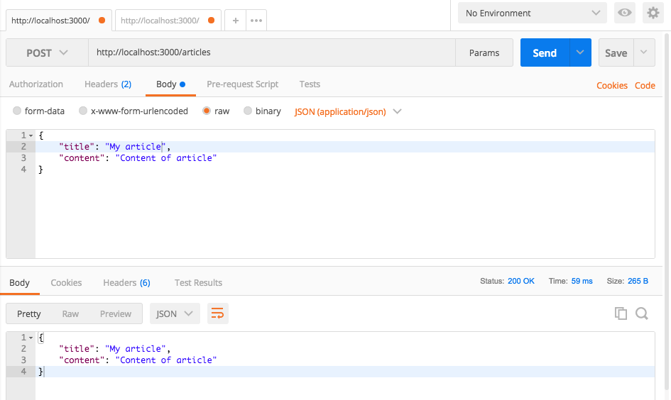
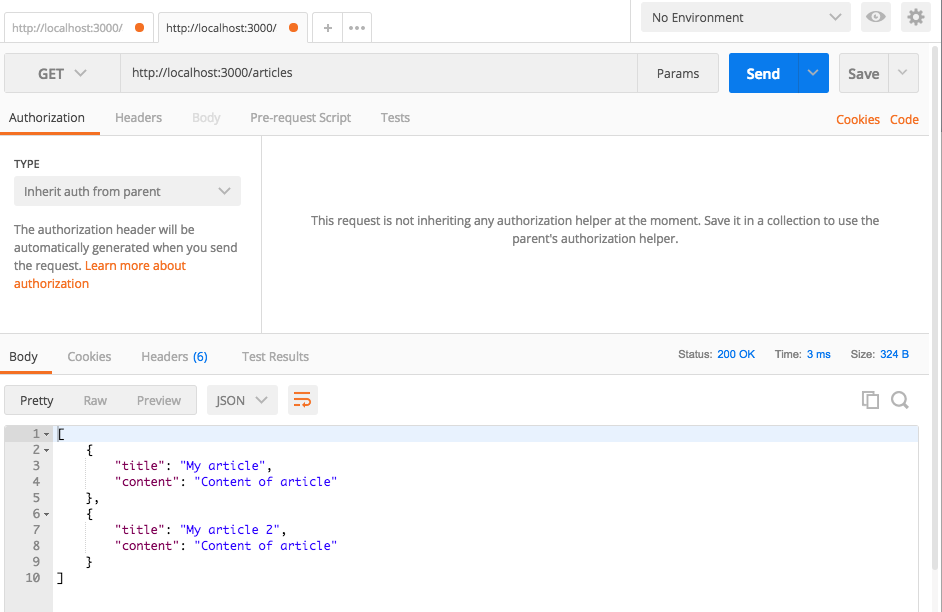

# Exercice 13 - Express

Nous allons créer notre première API en Node.js, elle permettra d'ajouter et de lister des articles.

## Instructions

* Installer `express body-parser`
* Créer un fichier `Article.js` qui contiendra la classe `Article` utilisée précédemment dans `main.js`
* Créer un fichier `app.js` qui exportera l'app Express qui répondra aux routes suivantes :
  * `POST /articles` : Ajoute un article dans un tableau
  * `GET /articles` : Renvoie tous les articles du tableau
* Modifier `server.js` pour utiliser `app`
* Utiliser POSTMAN pour tester les requêtes

**Résultat attendu**

### POST /articles



### GET /articles



## Aide

### Exporter une classe dans un fichier

```js
// MyClass.js
class MyClass {}

export default MyClass
```

### Ajouter body-parser

```js
app.use(bodyParser.json())
```

### Récupérer des données depuis une route "POST"

```js
const users = []

app.post('/users', (req, res) => {
  const user = new User(req.body)
  users.push(user)
  res.send(user)
})
```

### Afficher des données dans une route "GET"

```js
const users = []

app.get('/users', (req, res) => {
  res.send(users)
})
```

### HTTP + Express

```js
import http from 'http'
import app from './app'

const server = http.createServer(app)

server.listen(3000, () => {
  console.log(`Server is running at http://localhost:3000`)
})
```
