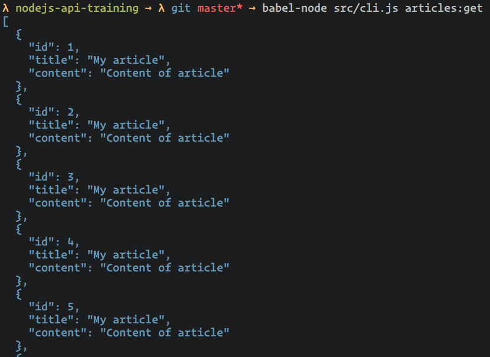

# Exercice 18 - Command Line Interface

Nous souhaitons créer un outil en ligne de commande afin d'interroger notre API.

## Instructions

### Créer un outil en ligne de commande

* Installer `commander axios`
* Créer un fichier "src/cli.js"
* A l'aide de commander, créer un outil en ligne de commande :

**Résultat attendu**

```
$ babel-node src/cli.js --help

  Usage: cli [options] [command]

  Options:

    -h, --help    output usage information

  Commands:

    articles:get  Get all articles
```

### Implémenter la commande "articles:get"

* Installer `chalk axios`
* A l'aide de axios, récupérer et afficher les articles
* A l'aide de chalk, afficher le résultat en bleu

**Résultat attendu**



### Implémenter la commander "articles:post"

* A l'aide de axios, implémenter une commander "articles:post"
* Afficher un message qui dit que l'article a été ajouté en vert

**Résultat attendu**

```
$ babel-node src/cli.js articles:post --title "My title" --content "My content"

Article added (id: 20) !
```

### Ajouter un loader

* Installer `ora`
* Ajouter un loader pendant que les articles se chargent

**Résultat attendu**

Un loader est affiché pendant que la requête est exécutée.

### Créer un vrai exécutable

* Créer un fichier "smooth-api" dans un dossier "bin"
* Changer les droits du fichier pour qu'il soit exécutable et ajouter le code suivant en première ligne :

```
#!/usr/bin/env node

require('../lib/cli.js')
```

* Lancer la commander `npm run build`
* Utiliser l'outil en ligne de commande

## Aide

### Créer un programme avec "commander"

```js
import program from 'commander'

program
  .command('order')
  .description('Order a new pizza')
  .option('-b, --bbq', 'Add bbq sauce')
  .option('-c, --cheese <type>', 'Add the specified type of cheese [marble]')
  .action(cmd => {
    console.log('A new pizza order')

    if (cmd.bbq) {
      console.log('with barbecue')
    }

    if (cmd.cheese) {
      console.log(`and cheese ${cmd.cheese}`)
    }
  })

program.parse(process.argv)
```

### Utiliser "axios"

```js
import axios from 'axios'

axios
  .get('http://localhost:3000/articles')
  .then(response => {
    console.log(response.status) // 200
    console.log(response.data) // Parsed body
  })
  .catch(error => {
    // Faire un throw dans le setTimeout permet de sortir de la Promise
    // l'erreur termine donc le programme
    setTimeout(() => {
      throw error
    })
  })

axios
  .post('http://localhost:3000/articles', {
    title: 'My title',
    content: 'My content',
  })
  .then(response => {
    console.log(response.status) // 200
    console.log(response.data) // Parsed body
  })
  .catch(error => {
    // Faire un throw dans le setTimeout permet de sortir de la Promise
    // l'erreur termine donc le programme
    setTimeout(() => {
      throw error
    })
  })
```

### Afficher des données JSON de manière lisible

```js
const data = [{ foo: 'bar' }]
console.log(JSON.stringify(obj, null, 2))
// Affiche l'objet au format JSON de manière lisible :
//
// [
//   {
//     "foo": "bar"
//   }
// ]
```

### Ajouter un loader avec ora

```js
import ora from 'ora'

const loader = ora('Loading...')

// Le loader est affiché
loader.start()

// Le loader est masqué
loader.stop()
```
